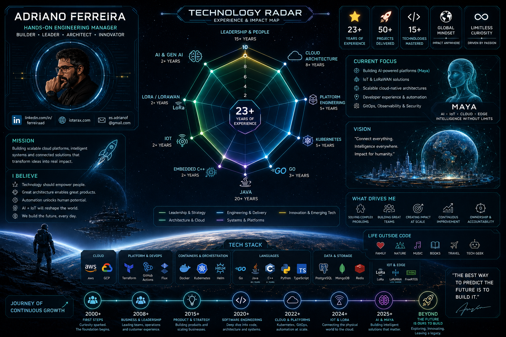
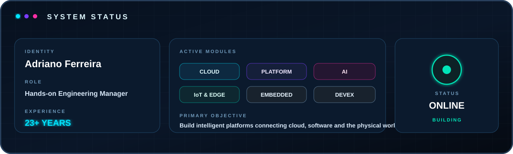
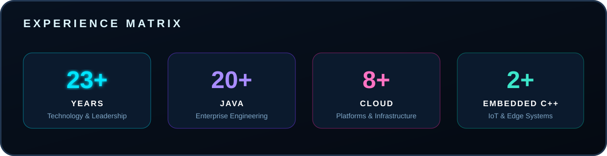
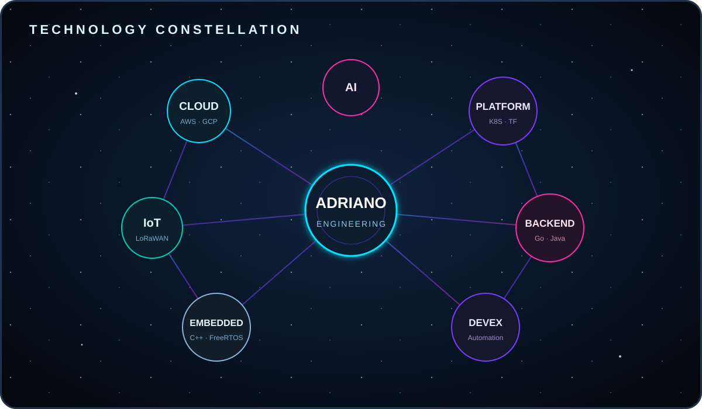

# Engineering Beyond Code

### Hands-on Engineering Manager · Cloud Architect · Platform Engineer

Building intelligent platforms that connect cloud, software, AI and the physical world.

---
 

  

  

---

## Technology Domains

---

## Core Stack

### Cloud and Platform

  

### Software Engineering

  

### Backend and Data

  

### DevOps and Observability

  

 

---
 

  

### Embedded and Connected Systems

  
  
  
  
  

---

## Engineering Principles

- ♻️ Build reusable capabilities, not isolated solutions
- 🧭 Think in systems and design for evolution
- ⚙️ Automate repetitive work
- 📊 Measure before scaling
- 🔐 Apply security by design
- 🚀 Treat developer experience as a product
- 🔭 Build observable systems
- 🌍 Connect software with real-world impact

 

---

 

  

---

## GitHub Analytics

 

---

### Cloud · Platform Engineering · AI · IoT · Embedded Systems

**Always learning. Always building. Always evolving.**

